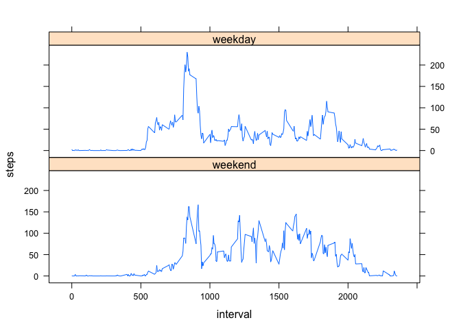

# Reproducible Research: Peer Assessment 1


## Loading and preprocessing the data
I use the dplyr and tidyr libraries for cleaning and organizing the data.  I use timeDate for separating weekdays from weekends, and lattice for making some of the graphs.  This code chunk reads in the data, changes the date column to "date" type, and then reads it into a new dataframe, tidydata, which can use the dplyr functions.

```r
library(tidyr)
```

```
## Warning: package 'tidyr' was built under R version 3.1.2
```

```r
library(dplyr)
```

```
## 
## Attaching package: 'dplyr'
## 
## The following object is masked from 'package:stats':
## 
##     filter
## 
## The following objects are masked from 'package:base':
## 
##     intersect, setdiff, setequal, union
```

```r
library(timeDate)
```

```
## Warning: package 'timeDate' was built under R version 3.1.2
```

```r
library(lattice)
fulldata <- read.csv("./activity.csv", header = TRUE)
fulldata$date <- as.Date(fulldata$date)
tidydata <- tbl_df(fulldata)
```
## What is mean total number of steps taken per day?
First, this code chunk makes a new data frame, steptotals, which has two columns, "steps" and "date".  There is one row for each unique "date" entry, and the "steps" column for each row contains the total number of steps taken on that date.

```r
steptotals <- tidydata %>%
  select(steps, date) %>%
  group_by(date) %>%
  mutate_each(funs(sum)) %>%
  unique() %>%
  arrange(date)
```

This histogram shows the number of days in which each range of number of steps was taken.

```r
hist(steptotals$steps, xlab = "Number of Steps", main = "Histogram of Total Steps per Day")
```

 

The mean number of steps per day (with NA values ignored) is given by

```r
mean(steptotals$steps, na.rm = TRUE)
```

```
## [1] 10766.19
```
The median number of steps per day (again, with NA values ignored) is given by

```r
median(steptotals$steps, na.rm = TRUE)
```

```
## [1] 10765
```

## What is the average daily activity pattern?
This code chunk creates a new data frame, intervaltotals, which has two columns, "steps" and "interval".  There is one row for each unique interval value, and the "steps" column in each row contains the average number of steps taken in that interval over all the days in the data set (with NA values ignored.)

```r
intervaltotals <- tidydata %>%
  select(steps, interval) %>%
  group_by(interval) %>%
  mutate_each(funs(mean(steps, na.rm = TRUE))) %>%
  unique() %>%
  arrange(interval)
```
This time series plot shows the average number of steps taken in each interval.

```r
plot(intervaltotals$interval, intervaltotals$steps, type = "l", xlab = "Interval", ylab = "Average Steps", main = "Average Steps per Interval")
```

 

To find the interval with the maximum average number of steps, this code chunk arranges the intervals in descending order by average number of steps, then prints the top interval.

```r
intervalarrange <- intervaltotals %>%
  ungroup() %>%
  arrange(-steps)
  
## interval with max steps:
intervalarrange$interval[1]
```

```
## [1] 835
```

## Imputing missing values
The total number of NA values is found via:

```r
countna <- is.na(tidydata$steps)
sum(countna)
```

```
## [1] 2304
```
I chose to impute the missing values by replacing NAs with the average number of steps for that interval.  The other strategy suggested, using the mean/median for that day, is not viable, because all the missing values are part of entire missing days, and so it is impossible to compute the mean or median of a day in which all the values are NA.  The new data frame, with the imputed values added, is called imputedata.  I used the average steps per interval computed in the previous question.

```r
imputedata <- tidydata
i <- 1
for (i in (1:nrow(tidydata))){
  if (is.na(tidydata$steps[i])){
    int <- tidydata$interval[i]
    introw <- filter(intervaltotals, interval == int)
    imputedata$steps[i] <- introw$steps[1]
  }
}
```
The next step is to create a histogram showing the total steps per day, with the imputed values added.  This is done in the same way as in the first question.

```r
impsteptotals <- imputedata %>%
  select(steps, date) %>%
  group_by(date) %>%
  mutate_each(funs(sum)) %>%
  unique() %>%
  arrange(date)

hist(impsteptotals$steps, xlab = "Number of Steps", main = "Histogram of Total Steps per Day (with imputed values")
```

 

You can see that the only difference was in the middle bar.  This is because all the missing values were entire missing days, and so replacing entire "NA" days with the averages for each interval simply added several completely average days to the dataset.

The mean number of steps, with imputed values, is found through

```r
mean(impsteptotals$steps)
```

```
## [1] 10766.19
```
and the median is

```r
median(impsteptotals$steps)
```

```
## [1] 10766.19
```
The mean did not change at all, because adding in new days whose total number of steps is the original mean will not change the mean.  The median becomes the same as the mean, since it was close to the mean to begin with, and now the middle value is one of the average days that were added by imputing values.

All in all, this is not a very effective way of imputing values when there are entire days missing like this.  This could be a useful method if some days had just a few individual intervals missing, thus making the totals for each day inaccurate, but when each day is either complete or totally missing, all this does is add in several identical "average" days, which distorts the data by making it seem like that middle bar of the histogram was taller, as compared to the total number of days, then it probably should have been.  Perhaps a better method would be, for instance, to replace all the values of a missing Tuesday with the average of all the other Tuesdays, and so on, but with a data set this small, that would create other issues.

## Are there differences in activity patterns between weekdays and weekends?
First, this code creates a new data frame, weekdaydata, that contains all the data from the imputedata frame, as well as an additional factor column, daytype, which contains either "weekday" or "weekend".

```r
weekdaydata <- mutate(imputedata, daytype = isWeekday(date))
weekdaydata$daytype <- factor(weekdaydata$daytype, labels = c("weekend", "weekday"))
```
Next, this creates another new data fram, smallweekdata, with three columns: "steps", "interval", and "daytype".  There is one row for each (interval, daytype) combination, with the "steps" column of each row containing the mean number of steps for that interval on either weekdays or weekends (including the imputed data).

```r
smallweekdata <- weekdaydata %>%
  select(steps, interval, daytype) %>%
  group_by(daytype, interval) %>%
  mutate_each(funs(mean)) %>%
  unique() %>%
  arrange(daytype, interval)
```
This panel plot shows the average number of steps per interval, divided into "weekday" and "weekend".

```r
xyplot(steps~interval|daytype, smallweekdata, type = "l", layout = c(1,2))
```

 
